# 视觉导航代码讲解与建模图谱（GNM / ViNT / NoMaD）

本文档面向仓库 `visualnav-transformer` 的主链路实现，目标是把代码结构、模型结构、训练与部署数据流一次讲清楚，并给出可直接复用的系统框图。

---

## 1. 讲解范围与代码锚点

### 1.1 主链路范围

- 训练入口与装配：`train/train.py`
- 训练循环与 checkpoint：`train/vint_train/training/train_eval_loop.py`
- 单步训练与损失：`train/vint_train/training/train_utils.py`
- 数据集与预处理：`train/vint_train/data/vint_dataset.py`、`train/vint_train/data/data_utils.py`、`train/vint_train/data/data_config.yaml`
- 模型定义：
  - `train/vint_train/models/gnm/gnm.py`
  - `train/vint_train/models/vint/vint.py`
  - `train/vint_train/models/nomad/nomad.py`
  - `train/vint_train/models/nomad/nomad_vint.py`
  - `train/vint_train/models/nomad/nomad_mamba.py`
  - `train/vint_train/models/nomad/mamba2.py`
  - `diffusion_policy/diffusion_policy/model/diffusion/conditional_unet1d.py`
- 部署推理：`deployment/src/utils.py`、`deployment/src/navigate.py`、`deployment/src/explore.py`

### 1.2 与 `diffusion_policy` 子项目的边界

- `visualnav-transformer/diffusion_policy` 是一个相对独立的子项目（有自己的训练/工作流）。
- 主链路（`train/train.py`）只复用了其中的扩散网络组件（核心是 `ConditionalUnet1D`）。
- 因此本讲解以 **GNM/ViNT/NoMaD 主训练链** 为主，把 `diffusion_policy` 作为“组件来源与扩展方向”说明。

### 1.3 系统总图（装配视角）

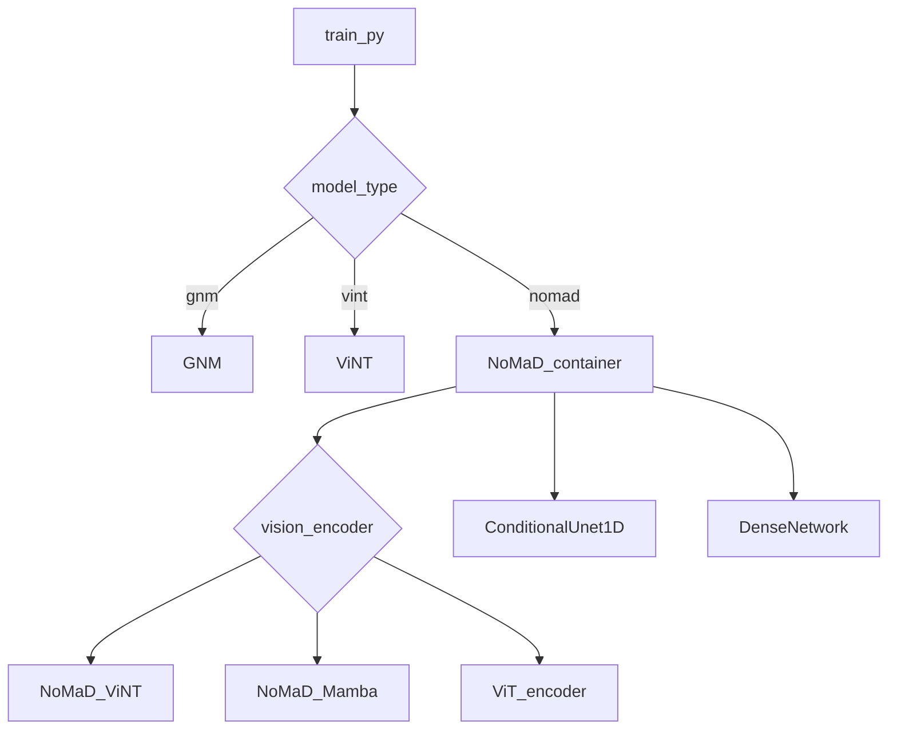

---

## 2. 数据管线与字段语义（统一输入口径）

### 2.1 数据来源

- 轨迹目录：`<traj>/0.jpg ... T.jpg + traj_data.pkl`
- `traj_data.pkl` 关键字段：
  - `position: [T, 2]`
  - `yaw: [T]`
- split 文件：`traj_names.txt`

### 2.2 `ViNT_Dataset.__getitem__` 输出字段（7 元组）

来自 `train/vint_train/data/vint_dataset.py`：

- `obs_image`: `[3*(context_size+1), H, W]`，多帧按通道拼接
- `goal_image`: `[3, H, W]`
- `action_label`: `[len_traj_pred, num_action_params]`
- `dist_label`: 标量（时间距离类别）
- `goal_pos`: `[2]`（局部坐标）
- `dataset_index`: 数据集索引
- `action_mask`: 标量 0/1（动作损失是否生效）

### 2.3 数据预处理与关键机制

- 图像：中心裁剪到 4:3，再 resize，训练时再做 ImageNet normalize（`train.py`）。
- 轨迹：从全局坐标转换到当前帧局部坐标（`to_local_coords`）。
- `learn_angle=True` 时，角度标签转为 `(cos, sin)`。
- `negative_mining`：可能从其他轨迹采目标图，产生“负目标”样本。
- `action_mask`：负样本或过近/过远样本不计动作损失。

### 2.4 主训练数据流

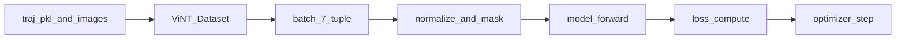

---

## 3. 模型结构卡片与系统框图

## 3.1 GNM

**代码锚点**：`train/vint_train/models/gnm/gnm.py`

**输入输出**

- 输入：`obs_img [B, 3*(context+1), H, W]`，`goal_img [B, 3, H, W]`
- 输出：
  - `dist_pred [B,1]`
  - `action_pred [B,T,2/4]`（位移 + 可选角度）

**结构要点**

- 两条 MobileNet 编码分支：
  - `obs_mobilenet` 编码历史观察
  - `goal_mobilenet` 编码 `obs+goal`
- 编码向量拼接后 MLP，分成距离头和动作头。
- 动作头输出后做 `cumsum`，将增量变 waypoint；角度分量做归一化。

**框图**

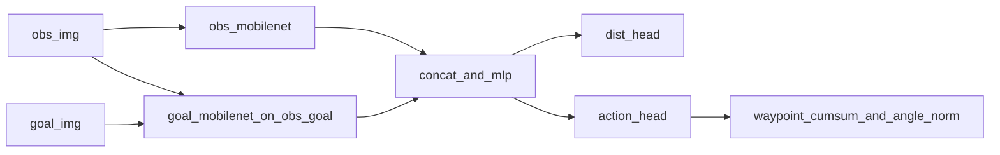

## 3.2 ViNT

**代码锚点**：`train/vint_train/models/vint/vint.py`、`train/vint_train/models/vint/self_attention.py`

**输入输出**

- 输入同 GNM
- 输出同 GNM

**结构要点**

- 帧级 EfficientNet 编码：把 `context+1` 帧拆到 batch 维编码，再还原为 token 序列。
- goal token 由 `goal_encoder` 提供（`late_fusion` 控制融合方式）。
- token 序列进入 `MultiLayerDecoder`（位置编码 + TransformerEncoder + MLP）。
- 最终向量接距离头与动作头。

**框图**

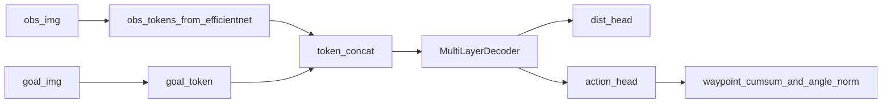

## 3.3 NoMaD（容器层）

**代码锚点**：`train/vint_train/models/nomad/nomad.py`

**输入输出接口**

- `model("vision_encoder", ...) -> obsgoal_cond [B,C]`
- `model("dist_pred_net", obsgoal_cond=...) -> [B,1]`
- `model("noise_pred_net", sample,timestep,global_cond) -> noise_pred`

**结构要点**

- NoMaD 是“可调度容器”，把视觉编码、距离头、扩散噪声头统一封装。
- 训练时 `train_utils.train_nomad` 分别调用三个子模块。

**框图**

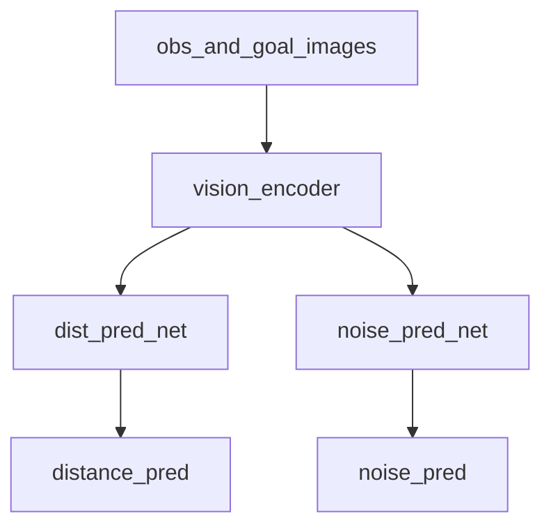

## 3.4 NoMaD_ViNT（NoMaD 的 Transformer 视觉编码器）

**代码锚点**：`train/vint_train/models/nomad/nomad_vint.py`

**输入输出**

- 输入：`obs_img`、`goal_img`、`input_goal_mask`
- 输出：`obs_encoding_tokens [B, C]`

**结构要点**

- obs 帧单独编码成时序 token，goal 由 `obs_current + goal` 的 6 通道编码得到。
- 位置编码 + TransformerEncoder。
- 支持 goal token mask（训练中的随机 goal mask）。
- 对 token 做掩码感知平均池化，形成全局条件向量。

**框图**

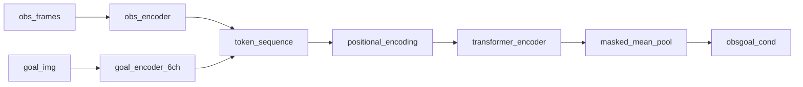

## 3.5 NoMaD_Mamba（NoMaD 的 Mamba 视觉编码器）

**代码锚点**：`train/vint_train/models/nomad/nomad_mamba.py`、`train/vint_train/models/nomad/mamba2.py`

**输入输出**

- 输入同 `NoMaD_ViNT`
- 输出同 `NoMaD_ViNT`

**结构要点**

- 支持 timm 多 backbone（EfficientNet/ResNet/ViT/DINO/ConvNeXt）。
- obs 与 goal 先分离编码，再通过门控/调制融合（`goal_gate`, `goal_delta`, `obs_goal_modulation`）。
- 序列建模从 Transformer 替换为 Mamba2 层（可双向）。
- 兼容 goal mask，并做加权池化输出条件向量。

**框图**

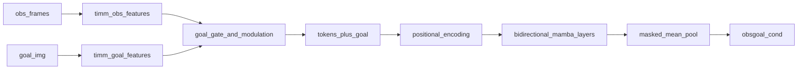

## 3.6 ConditionalUnet1D（NoMaD 扩散噪声预测头）

**代码锚点**：`diffusion_policy/diffusion_policy/model/diffusion/conditional_unet1d.py`

**输入输出**

- 输入：
  - `sample [B,T,action_dim]`（已加噪轨迹）
  - `timestep`
  - `global_cond [B,C]`（来自视觉编码器）
- 输出：`noise_pred [B,T,action_dim]`

**结构要点**

- 时间步嵌入（sinusoidal + MLP）与 `global_cond` 拼接成条件向量。
- 1D U-Net 主干：down/mid/up 多级残差块。
- 残差块内使用 FiLM 条件调制。

**框图**

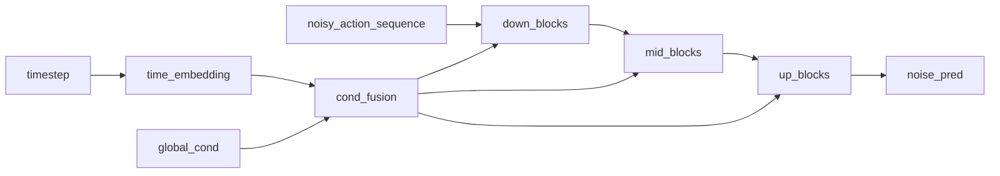

---

## 4. 训练与推理数据流（分模型）

## 4.1 ViNT / GNM 训练流

**代码锚点**：`train/train.py` + `train_utils.py::_compute_losses`

- 前向：`(obs_image, goal_image) -> (dist_pred, action_pred)`
- 损失：
  - `dist_loss = MSE(dist_pred, dist_label)`
  - `action_loss = masked MSE(action_pred, action_label)`
  - `total = alpha * 1e-2 * dist_loss + (1-alpha) * action_loss`

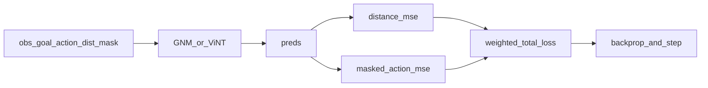

## 4.2 NoMaD 训练流（扩散 + 距离并行监督）

**代码锚点**：`train_utils.py::train_nomad`

- 视觉条件：`obsgoal_cond = model("vision_encoder", ...)`
- 距离支路：`dist_pred = model("dist_pred_net", obsgoal_cond)`
- 扩散支路：
  - 动作序列转 delta 并归一化
  - `noise_scheduler.add_noise`
  - `noise_pred = model("noise_pred_net", sample=noisy_action, timestep, global_cond=obsgoal_cond)`
- 总损失：`loss = alpha * dist_loss + (1-alpha) * diffusion_loss`

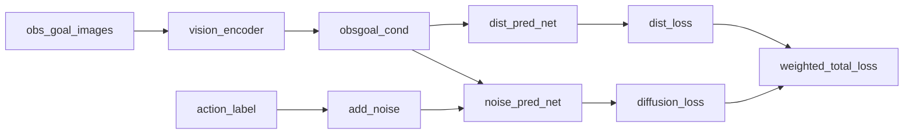

## 4.3 部署推理流（导航 / 探索）

**代码锚点**：`deployment/src/utils.py`、`deployment/src/navigate.py`、`deployment/src/explore.py`

- `utils.load_model()` 按训练配置重建网络并加载权重。
- `model_type=nomad` 时会构建 `DDPMScheduler`，在在线循环中做去噪采样得到动作。
- 非 NoMaD（GNM/ViNT）走直接前向预测路径。

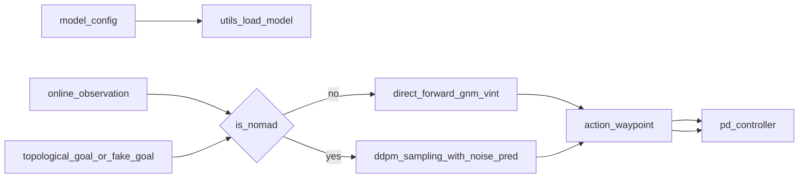

---

## 5. 模型差异对照（实现视角）

| 维度 | GNM | ViNT | NoMaD_ViNT | NoMaD_Mamba |
|---|---|---|---|---|
| 主任务形式 | 距离+动作回归 | 距离+动作回归 | 视觉条件编码（供扩散+距离） | 同左 |
| 视觉主干 | MobileNet | EfficientNet | EfficientNet + Transformer | timm backbone + Mamba2 |
| 时序建模 | 隐式（通道堆叠） | Transformer token 序列 | Transformer token 序列 | Mamba token 序列（可双向） |
| goal 融合 | obs+goal 编码分支 | goal token + decoder | goal token + mask | goal gate/modulation + mask |
| 动作生成 | 直接回归 waypoint | 直接回归 waypoint | 扩散去噪生成 | 扩散去噪生成 |
| 训练损失 | `dist + action` | `dist + action` | `dist + diffusion` | `dist + diffusion` |
| 推理复杂度 | 低 | 中 | 较高（迭代去噪） | 较高（迭代去噪） |

---

## 6. 建议讲解顺序（用于报告/分享）

1. **系统入口**：先讲 `train.py` 的 `model_type` / `vision_encoder` 两级分支。  
2. **统一数据观**：讲 `ViNT_Dataset` 的 7 元组与 `action_mask` 含义。  
3. **回归家族**：GNM -> ViNT，强调从 CNN 到 Transformer token 化。  
4. **扩散家族**：NoMaD 容器 -> `vision_encoder` -> `ConditionalUnet1D`。  
5. **NoMaD_ViNT vs NoMaD_Mamba**：同接口替换，不同序列建模器。  
6. **部署闭环**：`load_model` 到在线采样与控制接口。  
7. **收尾对照**：用差异表总结“什么时候选哪个模型”。  

---

## 7. 快速定位索引（按问题查文件）

- “模型怎么装配？” -> `train/train.py`
- “每个 epoch 怎么跑？” -> `train/vint_train/training/train_eval_loop.py`
- “loss 具体怎么算？” -> `train/vint_train/training/train_utils.py`
- “数据从哪来、长什么样？” -> `train/vint_train/data/vint_dataset.py`
- “NoMaD 视觉编码细节？” -> `train/vint_train/models/nomad/nomad_vint.py`、`train/vint_train/models/nomad/nomad_mamba.py`
- “扩散网络结构？” -> `diffusion_policy/diffusion_policy/model/diffusion/conditional_unet1d.py`
- “部署时如何加载模型？” -> `deployment/src/utils.py`

---

## 8. NoMaD_Mamba 注解版图谱（含维度）

本节给出可直接用于汇报的两张“带注解”图：

- 图1：`NoMaD_Mamba` 完整系统框图（模块职责 + 维度）
- 图2：训练时数据流图（每个张量在模型中的流动 + 维度）

以下维度以当前常见配置为例（可按你的配置替换）：

- `context_size=4` -> 观测帧数 `context+1=5`
- `image_size=[96,96]`
- `encoding_size=384`
- `len_traj_pred=8`
- `learn_angle=False` -> `action_dim=2`

### 8.1 NoMaD_Mamba 完整系统框图（注解版）

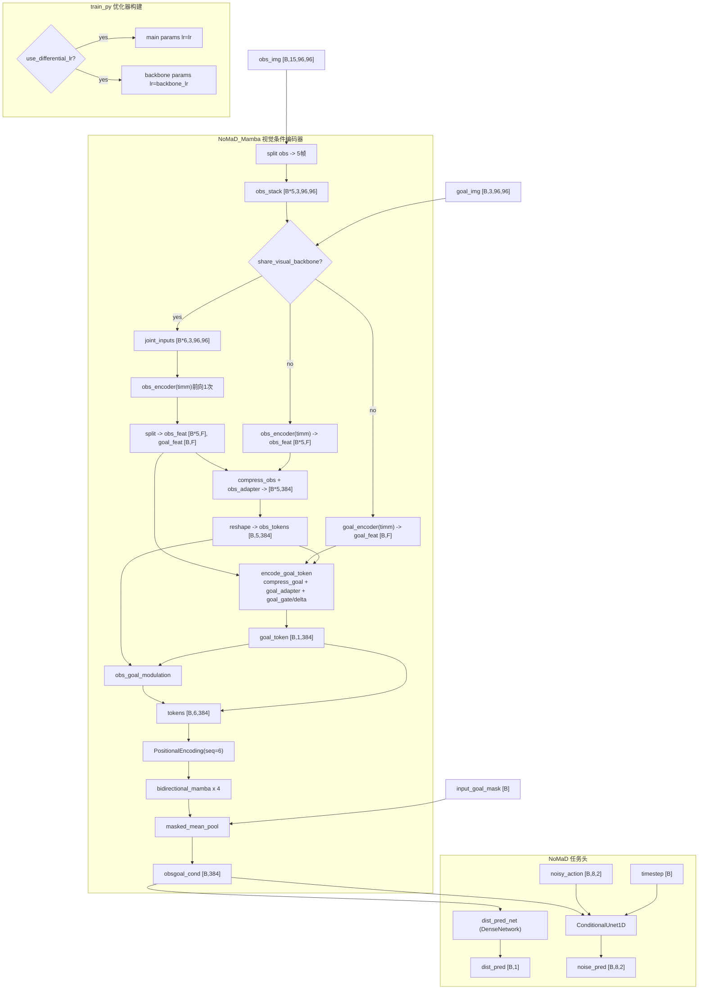

**图中注解说明**

- `share_visual_backbone=true` 时会走 `joint_inputs` 路径：obs 与 goal 一次 backbone 前向后再拆分，减少重复计算。
- `_encode_goal_token(..., goal_encoding=...)` 支持直接复用联合前向得到的 goal 特征，不必再次跑 goal backbone。
- `goal_gate + goal_delta` 是门控增量融合，不是简单拼接，goal token 更贴近当前观测语义。
- `bidirectional_mamba x 4`：前向建模历史，反向把 goal 信息传播回上下文，最后残差合并。
- `obsgoal_cond [B,384]`：共享条件向量，同时输入 `dist_pred_net` 与 `ConditionalUnet1D`。
- `use_differential_lr=true` 时，优化器分为 `main` 与 `backbone` 两组学习率。

### 8.2 训练时数据流图（注解版，含维度）

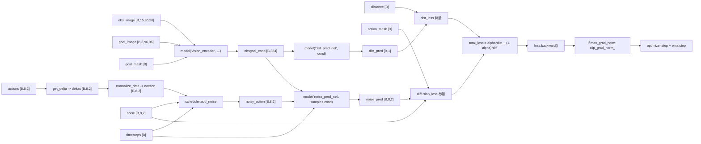

**图中注解说明**

- `get_delta`：把绝对轨迹转相邻增量，便于扩散模型学习局部动态。
- `normalize_data`：按 `data_config.yaml` 的 `action_stats` 映射到标准范围（代码里用于扩散训练）。
- `goal_mask [B]`：训练时随机屏蔽 goal token，形成条件/无条件混合学习信号。
- `action_mask [B]`：负样本或超范围样本不计动作相关损失。
- `diffusion_loss` 监督的是“预测噪声是否接近真实噪声”，不是直接监督动作值。
- `total_loss` 联合了可达性（距离）与可执行性（扩散动作）两条目标。
- 当前代码支持 `max_grad_norm` 全局梯度裁剪（启用时在 `backward` 后执行）。
